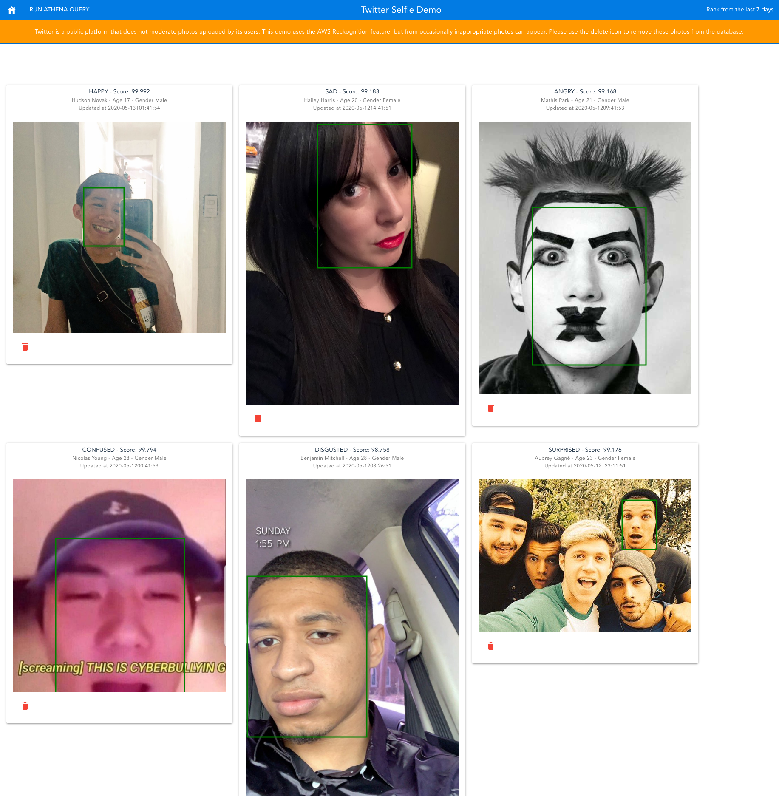
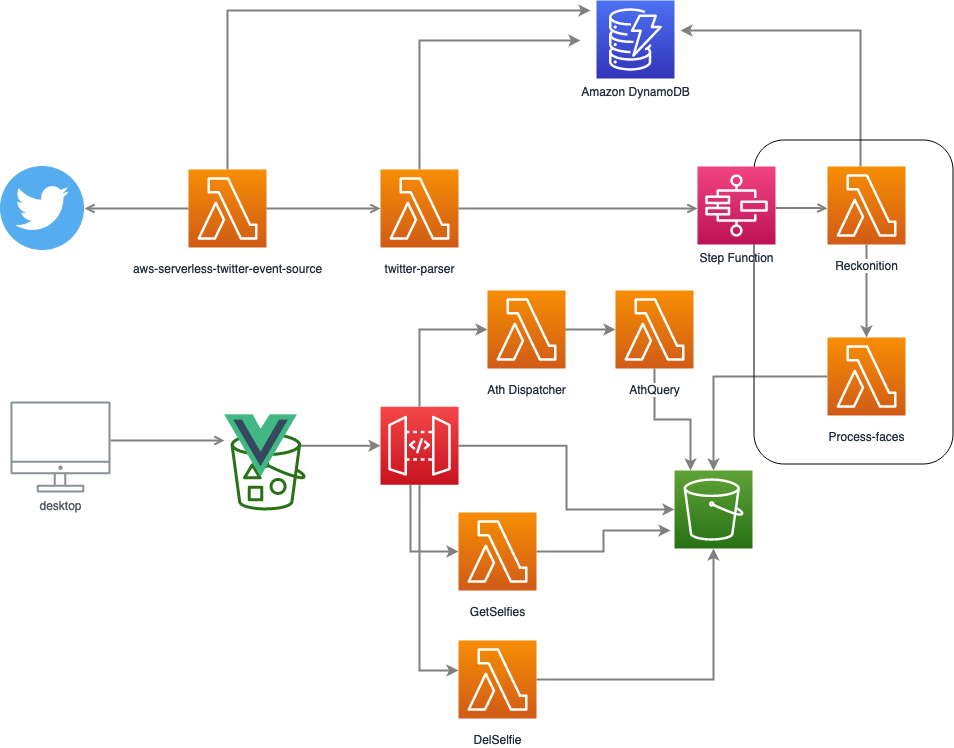

## Amazon Rekognition Twitter Selfie 



In this Serverless app we show a rank of the happiest, saddest among other emotions [Amazon Rekognition](https://aws.amazon.com/rekognition/) can detect from twits that have the word selfie in it. The app relies on lambda functions that extract, process, store and report the information from the picture. It is important to note that Twitter is a public platform that does not moderate photos uploaded by its users. This demo uses the AWS Reckognition moderation feature, but from occasionally inappropriate photos can appear. **User at your own discretion**


Below is the diagram for a depiction of the complete architecture.



## Initial environment setup

### Prerequisites

The Twitter-Selfie app is deployed through CloudFormation with an additional Vue.js application configuration. The following resources are required to be installed:

- [cfn-cli](https://github.com/Kotaimen/awscfncli) - A tool to abstract and simplify CloudFormation stack deployments
- npm to be able to build the Vue.js app
- [aws cli](https://docs.aws.amazon.com/cli/latest/userguide/cli-chap-install.html) to be able to interact with the AWS resources
- AWS Account and permissition to create the resources.

### Step 1: Execute cnf-cli to deploy all resources required for the solution to work

1. clone this repo and go to its directory
2. Execute cnf-cli to deploy all resources based on the *cfn-cli.yaml* file.
```
cfn-cli stack deploy
```
3. cfn-cli will install 4 cloudformation stacks and at the you should see:
```
02/30/22 17:00:38 - CREATE_COMPLETE - twitterSelfie-lambdas(AWS::CloudFormation::Stack) - arn:aws:cloudformation:us-west-2:00000000000:stack/twitterSelfie-lambdas/aaaad0a0-953a-11aa-aa32-06ae8ae0aa5a
Stack deployment complete.
```

### Step 2: Configure the twitter api keys and the Twitter Source Lambda

1. The Twitter Source lambda is based on the https://github.com/awslabs/aws-serverless-twitter-event-source. 
   1.1 This is how the Twitter Source app was configured: 
   - **SearchText** - *selfie* 
   - **StreamModeEnabled** - *true*
   - **PollingFrequencyInMinutes** - 10 min
   - **BatchSize** - 15
   - **TweetProcessorFunctionName** - The Parser's Lambda Function Arn.

2. The app requires the following Twitter API Keys: Consumer Key (API Key), Consumer Secret (API Secret), Access Token, and Access Token Secret. The following steps walk you through registering the app with your Twitter account to create these values.

    2.1 Create a Twitter account if you do not already have one
    2.2 Register a new application with your Twitter account:
        - Go to http://twitter.com/oauth_clients/new
        - Click "Create New App"
        - Under Name, enter something descriptive (but unique), e.g., aws-serverless-twitter-es
        - Enter a description
        - Under Website, you can enter https://github.com/awslabs/aws-serverless-twitter-event-source
        - Leave Callback URL blank
        - Read and agree to the Twitter Developer Agreement
        - Click "Create your Twitter application"
    2.3 (Optional, but recommended) Restrict the application permissions to read only
        - From the detail page of your Twitter application, click the "Permissions" tab
        - Under the "Access" section, make sure "Read only" is selected and click the "Update Settings" button
    2.4 Generate an access token:
        - From the detail page of your Twitter application, click the "Keys and Access Tokens" tab
        - On this tab, you will already see the Consumer Key (API Key) and Consumer Secret (API Secret) values required by the app.
        - Scroll down to the Access Token section and click "Create my access token"
        - You will now have the Access Token and Access Token Secret values required by the app.


3. The app expects to find the Twitter API keys as encrypted SecureString values in SSM Parameter Store. You can setup the required parameters via the AWS Console or using the following AWS CLI commands:
 ```
aws ssm put-parameter --name /twitter-event-source/consumer_key --value <your consumer key value> --type SecureString --overwrite
aws ssm put-parameter --name /twitter-event-source/consumer_secret --value <your consumer secret value> --type SecureString --overwrite
aws ssm put-parameter --name /twitter-event-source/access_token --value <your access token value> --type SecureString --overwrite
aws ssm put-parameter --name /twitter-event-source/access_token_secret --value <your access token secret value> --type SecureString --overwrite
  ```

### Step 3 : Create selfie table in Amazon Athena

1. Obtain the bucket name that solution uses to store the data that will be queries from athena running the command:
```
aws cloudformation describe-stack-resource --stack-name twitterSelfie-core --logical-resource-id Bucket --query "StackResourceDetail.PhysicalResourceId"
```

2. Edit the file athena.sql by replacing the *<app-bucket>* with the bucket name shown on the command above at the line **s3://<app-bucket>/selfie-reports/**

3. Create the table structure at Athena by running:
```
aws athena start-query-execution --query-string file://athena.sql --query-execution-context Database="default" --result-configuration OutputLocation=s3://<app-bucket>/ath-output
```

4. Get the **QueryExecutionId** from the command above to make sure the table was created successfully:
```
aws athena get-query-execution --query-execution-id a4aa277a-99a7-4995-9aa2-495a29a4aa7a --query QueryExecution.Status
``` 


### Step 4: Deploy Vue.js app into S3

1. Obtain the Amazon Api Gateway Id by running:
```
aws cloudformation describe-stack-resource --stack-name twitterSelfie-lambdas --logical-resource-id HttpApi --query StackResourceDetail.PhysicalResourceId
```
2. Create a file called .env at the *selfie-twitter-app* directory replacing *apigwid* with the value above and the *<aws-region>* with the region your are currently deploying the app. e.g. us-west-2
   - VUE_APP_AWS_API_URL=https://**<apigwId>**.execute-api.**<aws-region>**.amazonaws.com

3. Build the application 
```
npm run build
```

4. Copy the files to your bucket
```
aws s3 cp dist s3://<app-bucket> --recursive --acl public-read
```

5. Configure the application bucket to host a static website. https://docs.aws.amazon.com/AmazonS3/latest/dev/WebsiteHosting.html 


